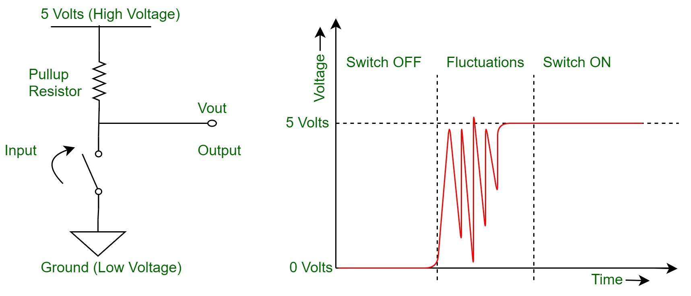

# Experiment RTL HARDWARE DESIGN USING VHDL
<em> Reference by "RTL Hardware Design Using VHDL" by PONG P. CHU - Cleveland State University </em>

# Chapter 1 - Introduction to Digital System Design

# Chapter 2 - Overview of Hardware Description Language

# Chapter 3 - Basic Language Constructs of VHDL

# Chapter 4 - Concurrent Signal Assignment Statement

# Chapter 5 - Sequential Statement of VHDL

# Chapter 6 - Synthesis of VHDL Code

# Chapter 7 - Combinational Circuit Design: Practice

# Chapter 8 - Sequential Circuit Design: Principle

> 

Sequential Circuit Design Model

</img>
 

>

Timing Diagram

</img>
 

# Chapter 9 - Sequential Circuit Design: Practice
  

## CLOCK DIVIDER
### Exercise 401 - 1Hz-Divider 
  - Goals: 
  - In gowin device's primitive lib, we only use gowin_osc clock generator (originally 250MHz --> 2,5MHz) and 5 gowin_clkdiv5 and 1 gowin_clkdiv8 to generate a 100Hz-signal. As the result, the system depends on Gowin FPGA.  
  - The Sequential Circuit Design Model-Based system diagram is showed below:  
    

  - Source code: [1Hz_Divider](Ex401/src/Devider_1Hz.vhd)

  
  - The demonstration link: https://www.youtube.com/channel/UCi_n5XIAMVjPtJlm0RjNEPw
## BINARY COUNTERS
### Exercise 421 - 3-bit Counter
 - Goals: Design a 3-bit counter that count from 000 to 111 and turn around 111 to 000 automatically. It use system clk 100Hz and use a user clock divider 1 Hz as enable port of Register.
 - System Diagram 
   

- <b>Note that </b>: The 3-bit counter have to have a "status" register to store current state status. Once current state is "111", the status register will be '1' (counting down)... and it decrease by 1, it is "110" but the status register is not enable and it also store '1'. Example, when current state = "010" and status register = '0' (counting up) so the next state = "011"... until the current state is "111", the status is store '1'... and so on.  
- <b>The demonstration link:</b> https://www.youtube.com/channel/UCi_n5XIAMVjPtJlm0RjNEPw  
- <b>Source code: </b> [3Bit_Counter](Ex421/src/Counter_3_Bit.vhd)

### Mod-N Count

# Chapter 10 - Finite State Machine: Principle and Practice

> 

  Block Diagram of an FSM

</img>
 

> Timing Analysis is discussed at Section 10.3 at page 321-326 of the textbook

## BUTTON DEBOUNCING CIRCUIT
- Goals: When we push a button or switch a toggle switch, it probably has some glitches as the picture. The goal of this problem is to generate the glitch-free output in the all triggering edges of input signal.

- The timing goal 

- The State Diagram

- The Algorithms State Machine (ASM) chart

- The Button debouncing circuit diagram

- Source code:  [Debouncer](Debouncer/src/components/Debouncer.vhd)

- Demonstration link: 
- Note that: The application of this circuit will be illustrated in the following sections.

## USER BUTTON COUNTERS
### Mod-9 Counter
- Goals: This circuit counts the binary numbers from 0000 to 1001 and displays them on a 7-segment display as decimal numbers. The counter is controlled by a user button, but it still uses the system clock as the clock supply source
- The system diagram:

- Note that: Because of using enable signal to control the counter, we must use a circuit that narrows the pulse input signal. As the result, the system will run properly when button is pushed and the counter will count up one times.
- Source code: 
  - [System](Debouncer/src/CounterSystemButton.vhd)
  - [Mod-9 Counter](Debouncer/src/components/Mod_9_Counter.vhd)
  - [Pulse Narrower](Debouncer/src/components/PulseNarrower.vhd)
  - [Debouncer](Debouncer/src/components/Debouncer.vhd)
- The demonstration link: https://www.youtube.com/channel/UCi_n5XIAMVjPtJlm0RjNEPw

### Mod-99 BCD Counter
- Goals:
- The system diagram:

### Mod-99 BCD Counter Up-Down Options

